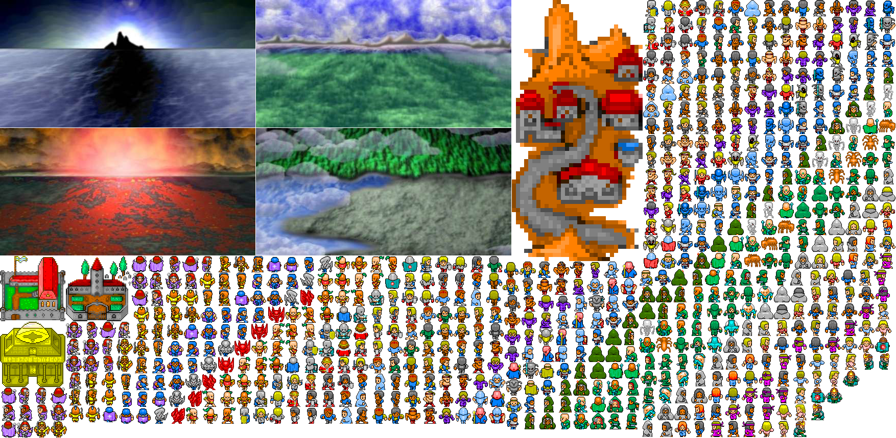
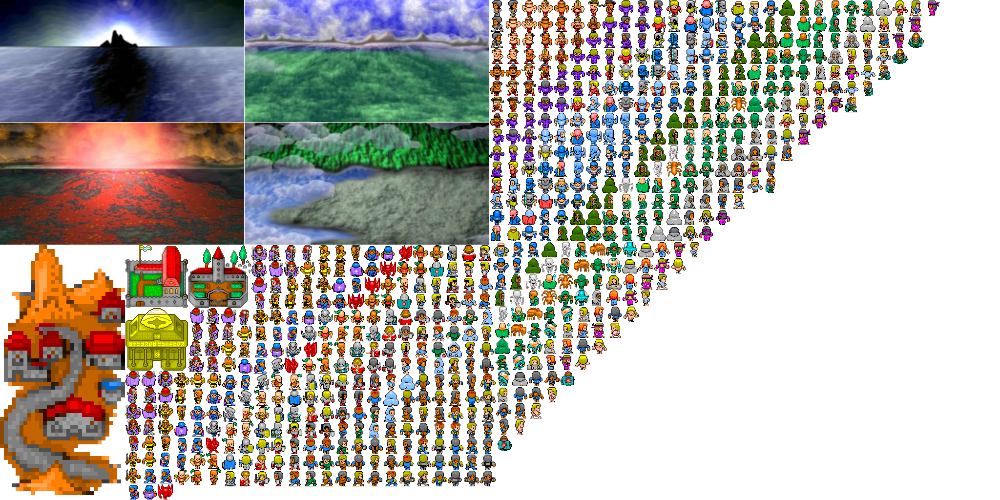
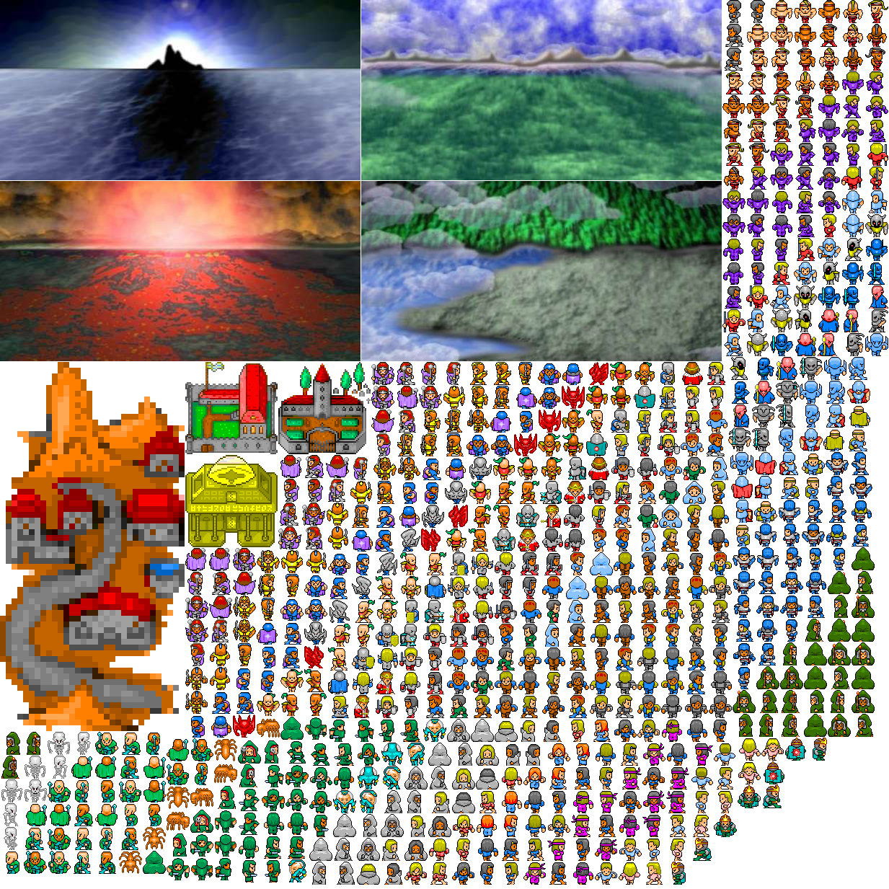
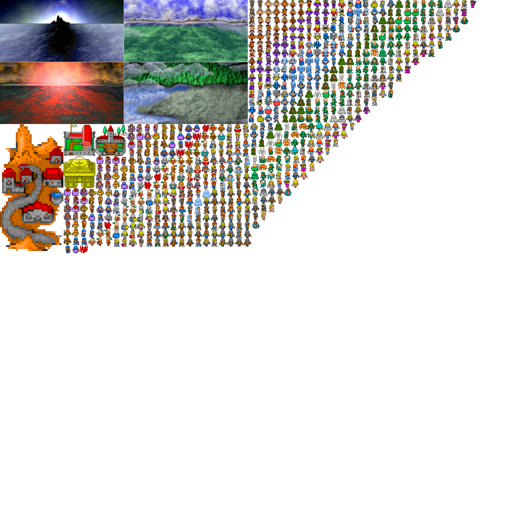

# sprpack

Command line sprite sheet packer is a .NET Core fork of [SpriteSheetPacker](https://github.com/kellygravelyn/SpriteSheetPacker) by [kellygravelyn](https://github.com/kellygravelyn).

I removed the windows forms GUI and replaced the Command line argument paser and also the use of System.Draw has been replaced with SixLabors.ImageSharp all in an effort to make this work in linux.

Sprite Sheet Packer is a fully featured tool for combining multiple individual images into a single, efficiently laid out image.

Sprite Sheet Packer supports reading PNG, JPG, BMP, and GIF images and produces a single PNG image with all the images embedded inside of it. The resulting image is transparent anywhere an image is not drawn. The tool also produces an accompanying file that maps the image file names with their rectangles, for use in your program to find the regions of the image you are interested in.

The tool supports options for setting the maximum resulting image size, padding (added to the size of the individual images), as well as options for requiring a power-of-two sized output and a square output.

Here are some sample output files created from 720 individual images found here: [blogoscoped.com](http://blogoscoped.com/archive/2006-08-08-n51.html) using various combinations of the "Require Power of Two Output" and "Require Square Output" options:

Non-power of two and non-square:

Power of two and non-square:

Non-power of two and square:

Power of two and square:

All code was originaly written by Kelly Gravelyn except the code for computing the efficient placement of the rectangles which was taken from the [Nuclex Framework](http://nuclexframework.codeplex.com/).

## sprpack --help

sprpack 1.0.0

Copyright (C) 2022 sprpack

  --image         (Default: Atlas.png) Output file name for the image.

  --map           (Default: Atlas.xml) Output file name for the map.

  --mw            (Default: 4096) Maximum output width.

  --mh            (Default: 4096) Maximum output height.

  --pad           (Default: 1) Padding between images.

  --pow2          (Default: false) Ensures output dimensions are powers of two.

  --sqr           (Default: false) Ensures output is square.

  --recursive     (Default: false) Searches subdirectories of any input directories.

  --il            Path to file listing the images to build.

  --help          Display this help screen.
  
  --version       Display version information.

  value pos. 0    Images to pack.
